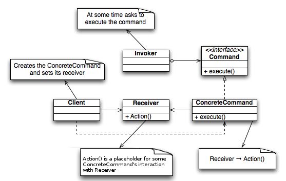

# 커맨드 패턴(Command Pattern)

**요청의 호출자(invoker)**과 **요청의 수신자(receiver)**사이에 의존성을 분리하는 패턴입니다.
호출과 처리 사이에 command 타입의 객체를 이용해 분리합니다.

커맨드 패턴을 사용한다면, 요청과 관련된 정보(그 요청안에 호출해야하는 리시버가 누구이고, 어떤 오퍼레이션을 호출해야하는지, 어떤 파라미터들은 뭔지, 그 명령을 수행하기 위한 모든 작업들)들을 전부 캡슐화해 객체를 서로 다른 요청 내역에 따라 매개변수화할 수 있습니다.
이러면 요청을 큐에 저장하거나 로그로 기록하거나 작업 취소 기능을 사용할 수 있습니다.

## 커맨드 패턴의 작동 원리

- 주문: 고객이 원하는 내용을 담고 있음
- 종업원: 주문 내용을 가지고, 요리사에게 주문이 들어왔음을 알리며 주문을 전달
- 요리사: 종업원에게 전달받은 주문을 보고, 이에 맞게 요리를 준비

- command: 요청 내용을 캡슐화
- invoker: command를 저장하고 있다가, command를 실행함
- receiver: command가 실행되면, command 내의 내용을 하나씩 수햄

## 코드로 이해하기

[예시 코드](https://github.com/sujeong-0/design-pattern/tree/b54924999d6e125fdc24141fe72a2d2fc4a8a402)

### 참조

- [도서 - 헤드 퍼스트 디자인패턴(개정판)](https://www.hanbit.co.kr/store/books/look.php?p_code=B6113501223)
- [백기선 - 코딩으로 학습하는 GoF의 디자인 패턴](https://www.inflearn.com/course/%EB%94%94%EC%9E%90%EC%9D%B8-%ED%8C%A8%ED%84%B4)