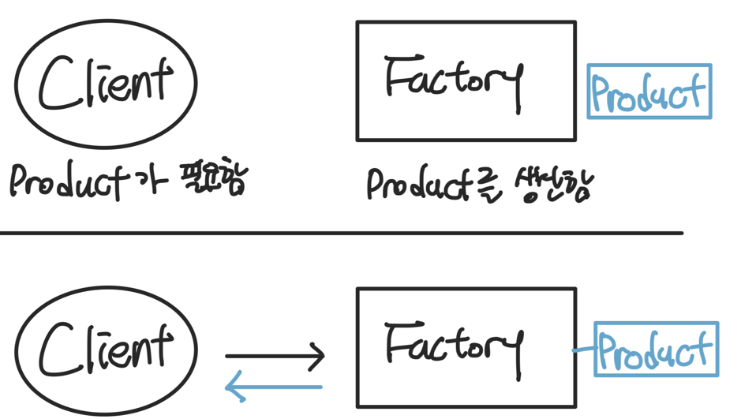
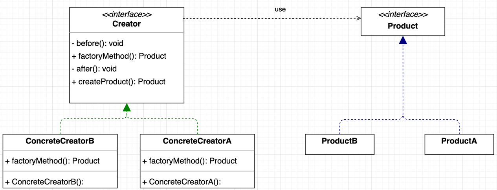
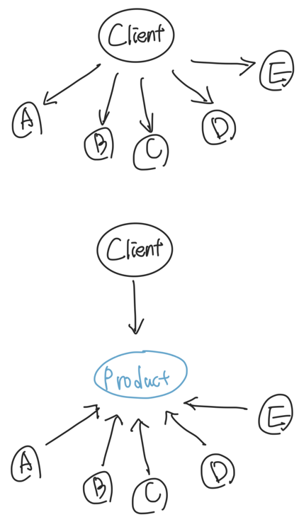
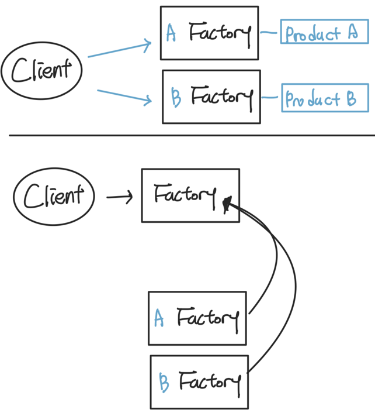

# 팩토리 메서드 패턴(Factory Method Pattern)

팩토리 메서드 패턴은 객체 생성에 대한 부분을 따로 분리하고 캡슐화 하며, 객체 생성을 할 때는 분리된 클래스를 이용해 생성하는 방식을 말합니다.

- 객체를 생성할 때 필요한 인터페이스를 만듭니다.
    - 객체 생성 이라는 행위를 캡슐화 합니다
- 어떤 클래스의 인스턴스를 만들지는 서브클래스에서 결정합니다.
    - 실제 생성되는 인스턴스의 종류는 캡슐화한 클래스의 서브클래스에 따라 결정됩니다.
- 클래스 인스턴스를 만드는 일을 서브클래스에게 맡기게 됩니다.

## 작동원리

특징

- Client가 Product를 필요로 할 때, 직접 생성하지 않고 Factory를 이용해 생성된 인스턴스를 받는다.
- Client는 Product가 어떻게 생성되는지 알필요가 없고 나중에 생성과정이 변경된다고 해도 클라이언트 코드는 이를 변경하지 않아도 된다.

## 코드로 이해하기

- Creator: Factory와 같은 개념으로, Product를 생성하는 내용을 정의한다.
- Product: Product의 추상화된 내용으로, 실제 Product는 이를 구현한 내용이다.

- [패턴 이해하기](https://github.com/sujeong-0/design-pattern/commit/f16280de53b94c8cef0cf2ab25528a6a765fca5f)
- [사례에 적용해보기](https://github.com/sujeong-0/design-pattern/commit/6e1b67c275b18cb0f744ecb7fabb3437b652083b)

## 의존성 뒤집기(Dependency Inversion Principle)

원래라면 Client 는 여러 개의 상품을 직접 의존하고 있었는데 Factory method 패턴에서는 이 의존성을 뒤집어, 
모든 객체가 Product라는 추상 클래스를 의존하게 되었습니다.

Factory 자체에서도 이를 적용할 수 있는데 여러 개의 구현된 Factory가 있을때,
Client가 구현된 Factory에 의존하는 것이 아니라 Factory를 의존하게 만들고, Factory의 구현체를 주입받는식으로 정의할 수 도 있습니다.

### 참조

- [도서 - 헤드 퍼스트 디자인패턴(개정판)](https://www.hanbit.co.kr/store/books/look.php?p_code=B6113501223)
- [강의 - 코딩으로 학습하는 GoF의 디자인 패턴](https://www.inflearn.com/course/%EB%94%94%EC%9E%90%EC%9D%B8-%ED%8C%A8%ED%84%B4)