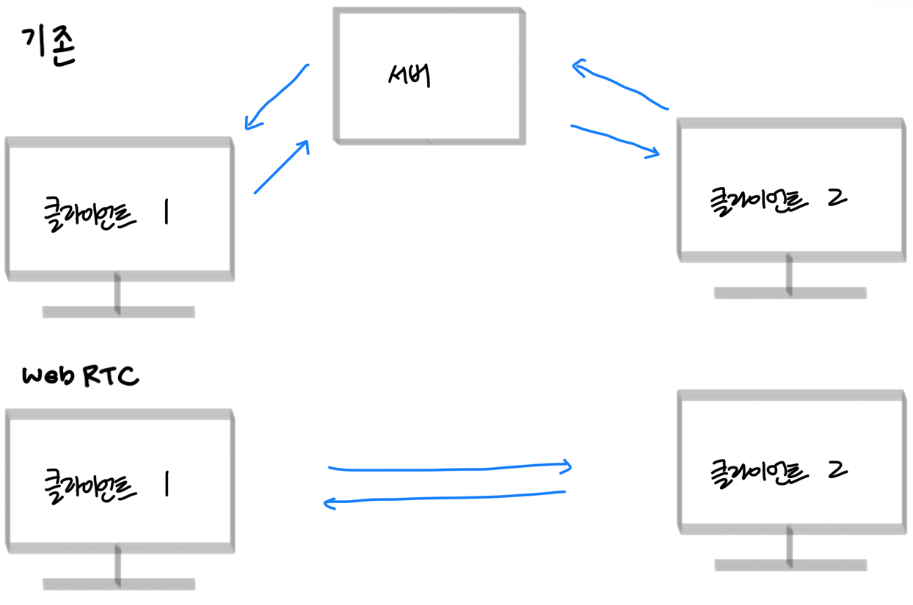
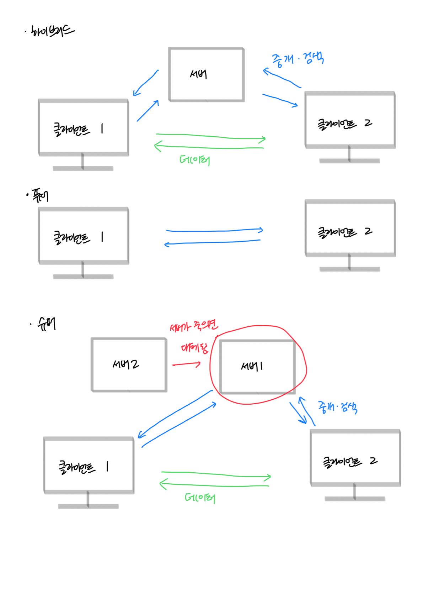

# WebRTC

> - WebRTC (Web Real-Time Communication)은 애플리케이션 프로그래밍 인터페이스(API)를 통해 웹 브라우저 와 모바일 애플리케이션 에 실시간 통신 (RTC)을 제공하는 무료 오픈 소스 프로젝트입니다.
> - 플러그인을 설치 하거나 네이티브 앱을 다운로드 할 필요 없이, P2P(Peer-to-Peer) 직접 통신을 통해 웹 페이지 내에서 오디오, 비디오 통신 및 스트리밍을 지원합니다

_[위키디피아 - WebRTC](https://en.wikipedia.org/wiki/WebRTC)_

P2P통신을 브라우저에서 가능하도록 지원하는 기능으로, 브라우저에서 API로 제공됩니다.
그렇기 때문에 다른 라이브러리 설치없이 javascript를 이용해 클라이언트를 구현할 수 있습니다.
이외의 환경에서는 webRTC를 구현하기 위한 라이브러리를 사용하면 됩니다.

## 기존 통신과 비교

- 기존 통신: 클라이언트끼리 통신하는 것이 아니라 서버를 거쳐서 통신함
    - 단점: 클라이언트가 증가하거나, 주고받는 데이터가 커질수록 서버의 부담이 증가함
- WebRTC: 클라이언트끼리 직접 통신하기 때문에 서버의 부담이 줄어듬(p2p)
    - 단점: 다대다 환경에서는 성능이 저하될 수 있습니다.(이경우 추가적으로 SFU, MCU를 적용) 

### P2P(peer to peer)

P2P(peer-to-peer network, 동등 계층간 통신망)은 비교적 소수의 서버에 집중하기보다는 망구성에 참여하는 컴퓨터들의 계산 및 대역폭 성능에 의존하여 구성되는 통신망이다.
클라이언트나 서버란 개념 없이, 오로지 동등한 계층 노드들(peer nodes)이 서로 클라이언트와 서버 역할을 동시에 네트워크 위에서 하게 된다.

#### 아키텍처

- 퓨어: 중앙 서버가 없는 방식, 서로가 클라이언트와 서버의 역할을 함
- 하이브리드: 데이터 송수신은 직접, 중개 및 검색은 서버의존
- 슈퍼: 퓨어 + 하이이브리드로 서버가 여러개 존재하고, 하나의 서버가 죽으면 다른 서버가 그 서버의 기능을 대체함

# 통신 흐름

1. 클라이언트끼리 연결
2. 실제 통신
3. 통신 종료

## Signaling

클라이언트끼리 연결되는 과정으로, 각 노드인 클라이언트와 무엇으로 어떻게 통신할 것인지를 정하는 과정입니다.

이 과정에서는 각 노드를 중개해줄 서버가 필요합니다. 

>  어떻게 구현되어야하는지는 WebRTC에서 명시되어있지 않기에 websocket, HTTP 등을 이용해 구현하면 됩니다.

### SDP(Session Description Protocol)

- signaling과정에서 사용되는 프로토콜입니다.
- 세션정보, 네트워크 관련정보, 미디어 유형, 스트림 속성등의 정보를 포함하고 있습니다.
- 개발자가 직접 작성하기 보다는 라이브러리를 이용해 작성합니다.

- 주요 내용
    - 무엇을 통신할 것인지: 오디오/비디오, 포맷, 해상도, 코덱 등
    - 어떻게 소통할 것인지: ICE candidate

#### ICE(Interactive Connectivity Establishment)

피어 간 연결 가능한 모든 경로 후보를 수집하고, 그중 최적의 경로를 선택하는 과정입니다.
최적의 경로를 찾기 위해 각 노드는 자신의 모든 경로 후보를 공유합니다.

- Host Candidate
    - 같은 로컬 네트워크에 속한 경우
    -  사설 IP와 통신에 사용할 포트 번호를 교환 
- Server Reflexive Candidate
    - 서로 다른 네트워크에 속한 경우
    - 공인 IP와 해당 노드의 포트 번호를 교환
    - STUN 서버 필요
        - 자기 자신의 공인 IP를 모르거나, 고정 IP가 아니라 변경되는 경우 통신을 할 때 자기 자신의 IP를 알기 위해 이용하는 서버
        - 다양한 무료 STUN 서버를 이용하거나, STUN를 직접 구축해 이를 이용하여 자신의 IP를 조회함
- TURN(Traversal Using Relays around NAT) 서버
    - 위 2가지 방식이 안되는 경우(복잡한 네트워크, P2P 차단, 방화벽 문제 등)
    - TURN 서버를 이용해 통신
        - 기존에 구축된 서버를 이용하거나, TURN 서버를 직접 구축해 이를 이용해 통신

## 통신

SRTP나 SCTP를 이용해 통신을 하며 실제 데이터 전송이 발생합니다.
 
보통은 음성통화나 화상채팅등에 활용되기 때문에 빠른 대용량 전송을 위해 TCP가 아닌 UDP를 기반으로 되어있습니다.

### SRTP(Secure Real-time Transport Protocol)

- 비디오나 오디오에 가장 많이 사용됨

### SCTP(Stream Control Transmission Protocol)

- 파일 전송에 많이 사용됩니다.
    - 파일 데이터는 중간어 어떤 데이터라도 누락되면 파일이 망가짐 
    - UDP기반이지만, TCP와 유사하게 신뢰성을 보장하도록 설계 되어있습니다.
 
###